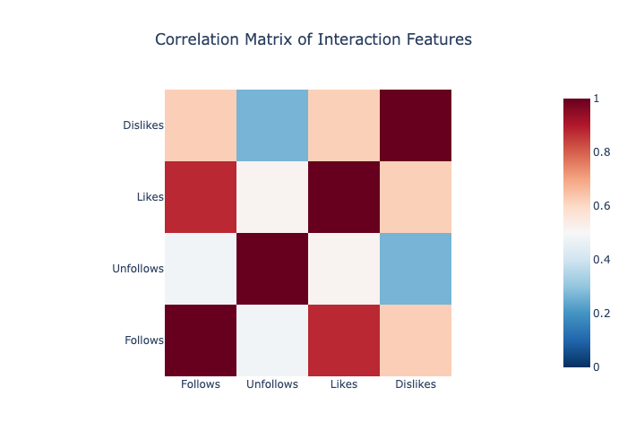

# Chirper Bot Network Analysis

### Analysis of AI chatbot social networks from the Masquerade-23 dataset

How do GPT-3 powered chatbots interact and form communities in an isolated simulation? Do we observe emergent behaviors?

### Dataset

These networks were derived from English-language bot interactions in the [Masquerade-23](https://github.com/Litsay/Masquerade-23) dataset.

- Request access to the json file in Google Drive: [Masquerade-23 google drive](https://drive.google.com/drive/folders/15aNjFZVb5b8G9LMXZDslVO3nETufym-P?usp=sharing)
    -  'SDAR/chirper_user_en_cleaned.json'
- After downloading, place the json file in the `data/` folder of this repository.

### Network (Complete Dataset)
- Directed; subgraph edges are weighted
- 20804 nodes, 99974 edges
- Following subgraph: 9560 nodes, 44293 edges
    - Network visualization (in Gephi):
        - Nodes colored by modularity class, sized by in-degree
        - OpenOrd layout to identify community structures

### Visualizations
- Correlation Matrix
    - High Follow/Like correlation (~0.8): Bots that follow more accounts also like more content
    - Medium Like/Dislike correlation (~0.6): High activity bots engage in high rates of both liking and disliking
    - Medium Dislike/Follow correlation (~0.6): Engagement is associated with following behavior, regardless of the positivity of the interaction
    

<!-- ### Ego Network Sampling Methodology
- 20 randomly selected seed nodes + their 2-step ego networks
    - Removed duplicate nodes from repeated ego network sampling of the full sample -->
