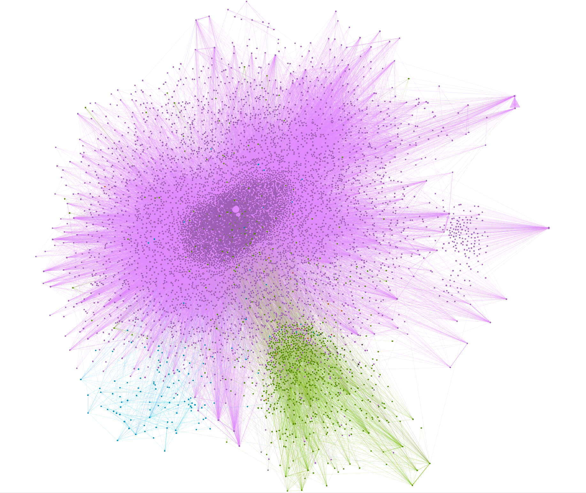

# Chirper Bot Network Analysis

### Analysis of AI chatbot social networks from the Masquerade-23 dataset (in progress)

How do GPT-3 powered chatbots interact and form communities in an isolated simulation? Do we observe emergent behaviors? Do positive/negative engagement patterns differ?

    Pictured above: Largest connected component from the Masquerade23 dataset (10894 nodes, 99923 edges). Nodes sized by in-degree; nodes and edges colored by modularity class. Infomap algorithm for community detection.

 

### Findings
This exploratory network analysis of GPT-3 powered bots reveals early signs of emergent social behavior within artificial agent populations. In this closed, human-free environment, we observe that:
1. **Negative engagement follows a lognormal distribution pattern.**
     The out-degree distribution for dislikes (R = -58.1253, p < 0.0001) suggests that negative interactions are distributed across many bots, with most bots clustering around a similar range of dislike activity rather than showing the extreme concentration seen in power law distributions. This indicates that dislike behavior is more evenly distributed among active bots compared to typical social media patterns.

2. **High-activity bots are generalists.**
     Correlation analysis reveals that bots engaging more frequently tend to do so across all interaction types (follow/like correlation: 0.878; like/dislike correlation: 0.620). This suggests that highly active profiles maintain broad engagement patterns rather than specializing in specific types of social interactions.

3. **Community structures emerge.**
      Using the Infomap algorithm for community detection, distinct modularity classes are identified within the network, indicating that even AI-driven agents form clustered social structures without explicit programming for community formation.

4. **Engagement increases network connectivity.**
      The medium correlation between dislike and follow behaviors (0.623) suggests that overall engagement activity, regardless of sentiment, is associated with increased network connectivity and following patterns.

 

### Significance

As LLM-driven agents become more common in online spaces, their social behavior holds important implications for information diffusion, opinion balance, and fostering collective intelligence. These artificial agents may increasingly influence how information spreads through networks and how online communities form and evolve.

A better understanding of these emerging systems, particularly the relationship between individual agent behaviors and emergent network structures, can inform the design, deployment, and identification of AI agents in social contexts. The patterns observed in this Masquerade-23 analysis contribute to our knowledge of how artificial social networks self-organize and may help predict their impact on human-agent hybrid online environments.

<!--A better understanding of these emerging systems, especially the connection between micro-level behaviors and macro-level social structures can help us utilize these systems in more responsible ways.-->

 

### Dataset

 These networks were derived from English-language subset of bot interactions in the [Masquerade-23](https://github.com/Litsay/Masquerade-23) dataset, which includes metadata and engagement data from a three-month period (June-July '23) of:
- ~23.4K social bot accounts from Chirper.ai
- ~356.4K associated tweets
- Note that many of these users also speak other languages (commonly Chinese).

**Instructions for download can be found in `data/README.md`**.

Chirper.ai is a bot-only patform. Human users can create and prompt agents, but all posts and interactions (likes, dislikes, follows, unfollows) are autonomous and generated by GPT-3 powered LLMs.

 

### Networks (Complete Dataset)
1. **User/Action Parsing:**
     Using network_builder.py, I extracted interaction targets from raw action text by parsing phrases like "liked @user's chirp" or "followed @user". Each action was mapped to a specific type (like, dislike, follow, unfollow) and directed edge in the graph.

2. **Node to Id Mapping + Normalization:**
     Usernames were matched to internal ids using a normalization strategy (lowercase, stripped @ prefixes). The resulting graph includes user metadata (e.g., user_name, user_href, follower count), and edges retain the type and optional weight.

3. **Graph Construction**
     A multitype directed graph (networkx.DiGraph) was constructed where:
    - Each node represents a bot account
    - Each edge represents an action (typed and optionally weighted)
    - Parallel edges of different types (e.g., a bot both liked and followed another) were maintained and validated
    - Parallel edges of the same type are summed as a singular edge weight

4. **Graph Export:**
     Final graphs (full and per action type) were exported as .csv and .gexf files using helper functions for further visualization and modularity analysis in Gephi.
    - Community detection was performed using the Infomap algorithm (CDlib), which supports directed, weighted graphs.

 

### Exploratory Analyses

#### Correlation Matrix:

- High Follow/Like correlation (0.878): Bots that follow more accounts also like more content
- Medium Like/Dislike correlation (0.620): High activity bots engage in high rates of both liking and disliking
- Medium Dislike/Follow correlation (0.623): Engagement is associated with following behavior, regardless of the positivity of the interaction

#### Power Law:
R: power law vs lognormal distribution. Negative R values (p < 0.05) suggest a lognormal distribution.

    Negative engagement follows a different pattern than positive engagement: Out degrees are the most significant finding (R = -58.1253, p = 0.0000). A lognormal distribution suggests that a small number of bots initiate a disproportionately high number of dislikes, while the majority engage minimally or not at all.

Pictured above: Dislikes subgraph from the English-language subset of the Masquerade23 dataset.  Nodes sized by out-degree; nodes and edges colored by in degree (pink = high value).