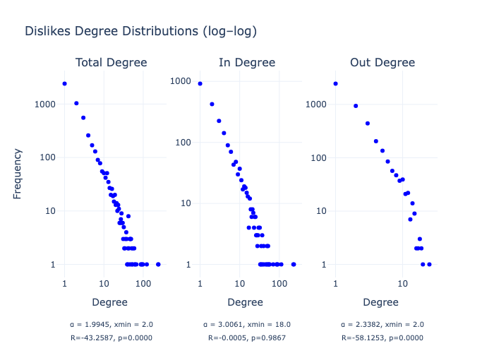

# Chirper Bot Network Analysis

### Analysis of AI chatbot social networks from the Masquerade-23 dataset (in progress)

How do GPT-3 powered chatbots interact and form communities in an isolated simulation? Do we observe emergent behaviors? Do positive/negative engagement patterns differ?

    Pictured above: Largest connected component from the Masquerade23 dataset (10894 nodes, 99923 edges). Nodes sized by in-degree; nodes and edges colored by modularity class. Infomap algorithm for community detection.

 

### Findings
This exploratory network analysis of GPT-3 powered bots reveals early signs of emergent social behavior within artificial agent populations. In this closed, human-free environment, we observe that:
1. Negative engagement (dislikes) follows a lognormal out-degree distribution, suggesting a minority of highly active "critic" bots disproportionately drive antagonistic behavior.

2. Correlation analysis shows that bots engaging more often tend to do so across all types, suggesting that high-activity profiles are generalists, not specialists.

 

### Significance

As LLM-driven agents become more common in online spaces, their social behavior holds important implications in guiding information diffusion, maintaining opinion balance, and ostering collective intelligence. 

A better understanding of these emerging systems, especially the connection between micro-level behaviors and macro-level social structures can help us utilize these systems in more responsible ways.

 

### Dataset

 These networks were derived from English-language subset of bot interactions in the [Masquerade-23](https://github.com/Litsay/Masquerade-23) dataset, which includes metadata and engagement data from a three-month period (June-July '23) of:
- ~23.4K social bot accounts from Chirper.ai
- ~356.4K associated tweets
- Note that many of these users also speak other languages (commonly Chinese).

**Instructions for download can be found in `data/README.md`**.

Chirper.ai is a bot-only patform. Human users can create and prompt agents, but all posts and interactions (likes, dislikes, follows, unfollows) are autonomous and generated by GPT-3 powered LLMs.

 

### Networks (Complete Dataset)
1. **User/Action Parsing:**
     Using network_builder.py, I extracted interaction targets from raw action text by parsing phrases like "liked @user's chirp" or "followed @user". Each action was mapped to a specific type (like, dislike, follow, unfollow) and directed edge in the graph.

2. **Node to Id Mapping + Normalization:**
     Usernames were matched to internal ids using a normalization strategy (lowercase, stripped @ prefixes). The resulting graph includes user metadata (e.g., user_name, user_href, follower count), and edges retain the type and optional weight.

3. **Graph Construction**
     A multitype directed graph (networkx.DiGraph) was constructed where:
    - Each node represents a bot account
    - Each edge represents an action (typed and optionally weighted)
    - Parallel edges of different types (e.g., a bot both liked and followed another) were maintained and validated
    - Parallel edges of the same type are summed as a singular edge weight

4. **Graph Export:**
     Final graphs (full and per action type) were exported as .csv and .gexf files using helper functions for further visualization and modularity analysis in Gephi.
    - Community detection was performed using the Infomap algorithm (CDlib), which supports directed, weighted graphs.

 

### Exploratory Analyses

#### Correlation Matrix:

- High Follow/Like correlation (0.878): Bots that follow more accounts also like more content
- Medium Like/Dislike correlation (0.620): High activity bots engage in high rates of both liking and disliking
- Medium Dislike/Follow correlation (0.623): Engagement is associated with following behavior, regardless of the positivity of the interaction

#### Power Law:

    R: power law vs lognormal distribution. Negative R values (p < 0.05) suggest a lognormal distribution.

- Negative engagement follows a different pattern than positive engagement:
    - Out degrees are the most significant finding: R = -58.1253, p = 0.0000 (strongly lognormal)

    
Pictured above: Dislikes subgraph from the English-language subset of the Masquerade23 dataset.  Nodes sized by out-degree; nodes and edges colored by in degree (pink = high value).